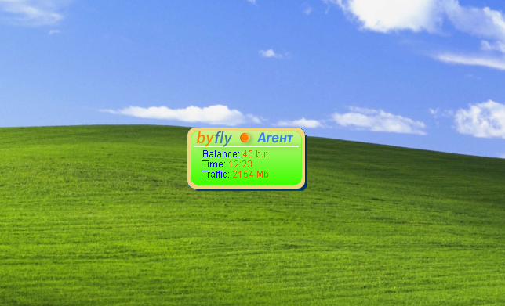
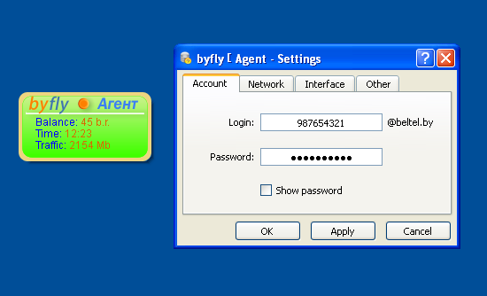
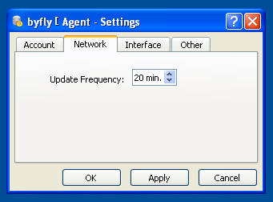
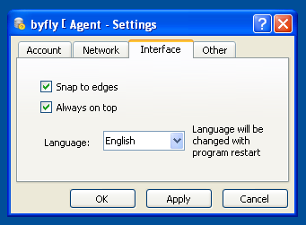
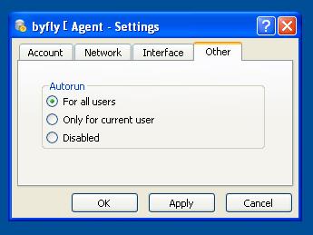

# Byfly Agent

This is a Windows desktop widget app developed to control the balance of the Byfly account, a popular Internet Service Provider (ISP) in Belarus.

## A Note From the Author

Please be aware that this project was written back in 2009 when I was still a high school student. Therefore, the code you see here is far from perfect and does not necessarily reflect best practices or my current coding standards. I am aware that the app has not been functional for a long time, but I've chosen to keep this repository for nostalgic reasons and to showcase my programming journey.

## Screenshots

### Widget

### Settings

